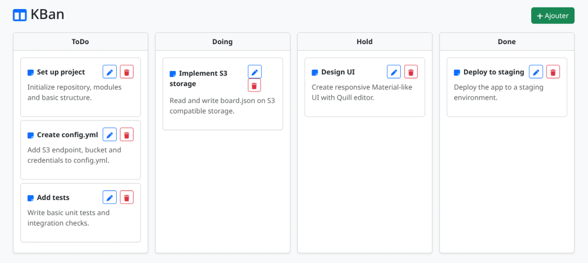

# Kanban Board

A simple Kanban web app in Go.

---
## Features
- Columns: ToDo, Doing, Hold, Done
- Create, edit, move, delete cards (title, description)
- Drag & drop cards
- Responsive UI (Bootstrap, Font Awesome, Quill editor)
- S3 storage (AWS, MinIO, ScaleIO, etc.)
- Configurable via config.yml

---
## Usage
1. Copy and edit config.yml (see example)
2. Run: `go build && ./kban`
3. Open browser at http://localhost:8080

---
## Requirements
- Go 1.20+
- S3 bucket accessible

---
## Config
Edit config.yml for your S3 settings.

---

